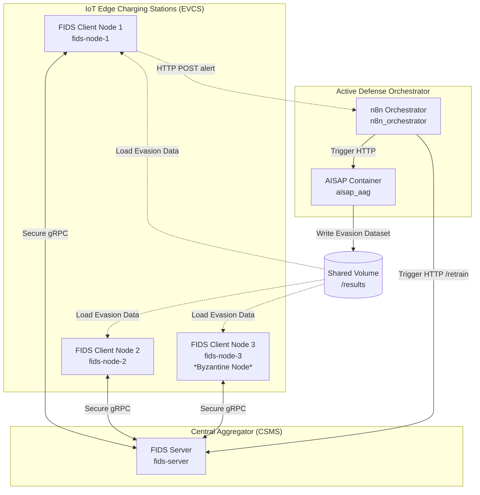

# Fed-OCPP-Secure: Byzantine-Robust Federated Intrusion Detection for EV Charging Networks

[](https://www.python.org/)
[](https://www.docker.com/)
[](https://flower.ai/)
[](https://github.com/ITHACA-Lab)

An end-to-end, orchestrated active defense pipeline for Electric Vehicle Charging Stations (EVCS) operating under the OCPP 1.6 protocol. Using a Byzantine-robust Federated Learning (FL) framework, this project dynamically identifies compromised node states, simulates white-box adversarial samples on-the-fly, executes regularized federated retraining rounds, and deploys security patches to edge charging nodes in real-time.

---

## Table of Contents
* [Short Description](#short-description)
* [Background & Architecture](#background--architecture)
* [Dependencies & Prerequisites](#dependencies--prerequisites)
* [Installation & Deployment](#installation--deployment)
* [Uninstallation & Cleanup](#uninstallation--cleanup)
* [Configuration](#configuration)
* [Usage & Examples](#usage--examples)
* [API & Metrics](#api--metrics)
* [Maintainers & Contributors](#maintainers--contributors)
* [Contributing](#contributing)
* [Acknowledgments & Funding](#acknowledgments--funding)
* [License](#license)

---

## Short Description
This repository integrates a decentralized Federated Intrusion Detection System (FIDS) with an automated threat mitigation loop managed by n8n. It automatically ingests raw network telemetry, trains a baseline Multi-Layer Perceptron (MLP) model on 47 OCPP application-layer features, and uses local Fast Gradient Sign Method (FGSM-AT) with FedProx regularization to flag and neutralize session disruptions, heartbeats flooding, charging profile modifications, and unauthorized access attempts.

---

## Background & Architecture
The system operates as a five-tier distributed active defense architecture, fully containerized:

1. **FIDS Clients (`fids-node-1`, `fids-node-2`, `fids-node-3`):** Distributed edge agents representing charging spots. They perform local inference on network telemetry and run local adversarial training (50-50 clean/FGSM split) during retraining rounds.
2. **FIDS Server (`fids-server`):** The central CSMS aggregator. It coordinates FL cycles and hosts robust aggregation strategies (FedMedian, Multi-Krum/Bulyan) to filter out poisoned weight updates from Byzantine clients.
3. **n8n Orchestrator (`n8n_orchestrator`):** An event-driven state machine webhook that automates the mitigation cycle when clients trigger alert events.
4. **AISAP Engine (`aisap_aag`):** A white-box adversarial generation container that calculates gradients ($\nabla_X L(w,X,y)$) using the latest global model weights to compile robust training sets.
5. **Shared Volume Mount (`/results`):** Provides a zero-copy data exchange for synchronized weights and adversarial patches.

### Data Flow Diagram



---

## Dependencies & Prerequisites
To run the project in production (recommended), the only prerequisites are:
* **Docker** >= 24.0.0
* **Docker Compose** >= 2.20.0

For local development without containers, you will need:
* **Python** = 3.10
* **TensorFlow** >= 2.15.0
* **Adversarial Robustness Toolbox (ART)** >= 1.17.0

---

## Installation & Deployment
Deploying the entire 5-container active defense stack is done with a single command.

1. **Clone the repository:**
   ```bash
   git clone https://github.com/your-username/fed-ocpp-secure.git
   cd fed-ocpp-secure
   ```

2. **Build and start the containers in the background:**
   ```bash
   docker compose up --build -d
   ```

3. **Confirm that all containers started successfully:**
   ```bash
   docker compose ps
   ```

Once deployed, the following ports are mapped to your host machine:
* **n8n Orchestrator UI:** http://localhost:5678
* **FIDS Server API:** http://localhost:5000
* **AISAP Generator API:** http://localhost:8000
* **FIDS Client 1 API:** http://localhost:5001
* **FIDS Client 2 API:** http://localhost:5002
* **FIDS Client 3 API:** http://localhost:5003

---

## Uninstallation & Cleanup
To stop and remove all containers, networks, and volumes safely, run:
```bash
docker compose down -v
```
This ensures cluster hygiene and frees up all bound ports (5000, 5001, 5002, 5003, 5678, 8000, 8080) on the host.

---

## Configuration
Custom options are configured in the following files:

### 1. Docker Compose Environment Configurations
In `docker-compose.yml`, you can edit client/server behaviors:
* `SERVER_URL`: Set to `http://fids-server:5000` to bind clients dynamically.
* `NODE_ID`: Specifies the client identifier (`fids-node-1`, `fids-node-2`, `fids-node-3`).

### 2. Active Retraining Hyperparameters
During orchestration, n8n sends JSON payloads to the FIDS server's `/retrain` endpoint. You can modify these settings:
* `strategy`: Set to `fedprox`, `fedmedian`, or `fedavg` to define the Flower aggregation rule.
* `mu`: The proximal regularization term coefficient (default: `0.01`).
* `rounds`: The number of global federated rounds (default: `3`).

---

## Usage & Examples

### 1. Monitor Containers Log Streams
Open a terminal to watch the real-time FIDS server aggregation logs:
```bash
docker compose logs -f fids-server
```

### 2. Trigger Evasion Attack Simulation
Open a new terminal in the project root and execute the automated attack injection script to target `fids-node-1`:
```bash
python attacker.py fgsm http://localhost:5001
```

* **Expected output for a vulnerable v1 model:**
  ```text
  [*] Ξεκινάει χειροκίνητη επίθεση στο http://localhost:5001...
  [*] Attack Type: FGSM
  [*] Payload: Adversarial FGSM Attack
  
  [!] [FAIL] Η επιθεση πετυχε! Προσβαση στο συστημα (Status: 400)
  ```
  *(The client detects accuracy degradation, returns 400 Bad Request, and issues an HTTP alert to n8n to start the active defense retraining cycle).*

* **Expected output for a patched v2 model (after retraining):**
  ```text
  [*] Ξεκινάει χειροκίνητη επίθεση στο http://localhost:5001...
  [*] Attack Type: FGSM
  [*] Payload: Adversarial FGSM Attack
  
  [OK] [SUCCESS] Η επιθεση αποκρουστηκε/αγνοηθηκε απο το Firewall/Defense (Status: 200)
  ```

---

## API & Metrics

### Client Simulation Endpoint
* **Endpoint:** `POST http://localhost:5001/simulate_attack`
* **Payload:**
  ```json
  {
    "payload": "Evasion Exploit",
    "attack_type": "fgsm"
  }
  ```
* **Response (Compromised v1):**
  ```json
  {
    "node_id": "fids-node-1",
    "attack_type": "fgsm",
    "accuracy": "15.10%",
    "f1_score": "0.14",
    "status": "compromised",
    "result": "Το Σύστημα Παραβιάστηκε"
  }
  ```

### FIDS Server Retrain Endpoint
* **Endpoint:** `POST http://localhost:5000/retrain`
* **Payload:**
  ```json
  {
    "strategy": "fedprox",
    "mu": 0.01,
    "rounds": 3
  }
  ```
* **Response:**
  ```json
  {
    "status": "success",
    "message": "Flower FL Retraining triggered.",
    "strategy": "fedprox",
    "rounds": 3,
    "pid": 26
  }
  ```

---

## Maintainers & Contributors
* **Ioannis Ktenidis** - University of Western Macedonia
* **Athanasios Liatifis** - University of Western Macedonia
* **Dimitrios Pliatsios** - University of Western Macedonia
* **Thomas Lagkas** - International Hellenic University
* **Panagiotis Sarigiannidis** - University of Western Macedonia

---

## Contributing
We welcome contributions! Please follow these guidelines:
1. Fork the repository.
2. Create a feature branch (`git checkout -b feature/AmazingFeature`).
3. Commit your changes (`git commit -m 'Add some AmazingFeature'`).
4. Push to the branch (`git push origin feature/AmazingFeature`).
5. Open a Pull Request.

---

## Acknowledgments

For more information and related research, please visit [ITHACA-Lab](https://github.com/ITHACA-Lab).

<p align="center">
  
</p>

---

## License
Distributed under the MIT License. See `LICENSE` for more information.
